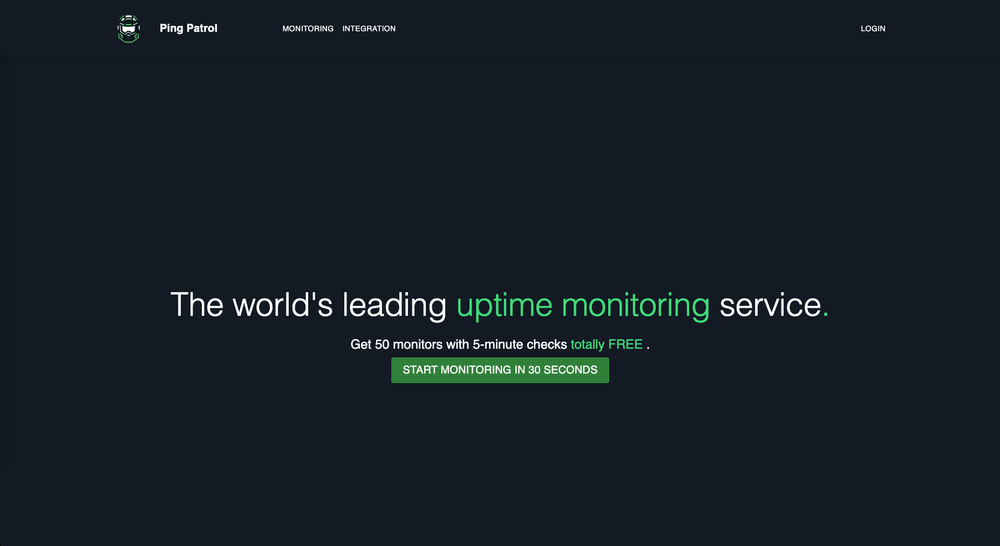
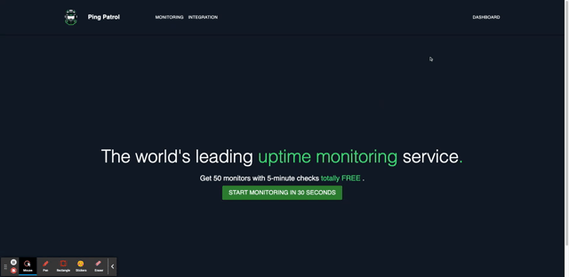
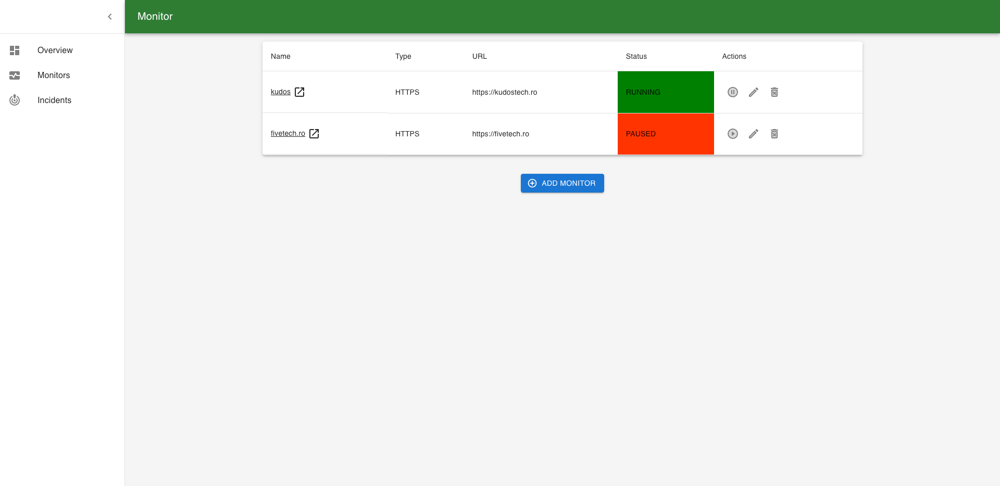

# Ping Patrol

## Project Overview

### Description

PingPatrol is a web-based uptime monitoring service, designed to offer basic functionalities similar to UptimeRobot. It
aims to provide users with the capability to monitor the availability of their websites and receive notifications in
case of downtime. The project's goal is to deepen knowledge in Java Spring Boot, ReactJS, and cloud technologies, while
creating a functional and user-friendly service.

### Functionalities

1. **Website Monitoring**: Regular checks of user-specified websites to determine availability.
2. **Alerts**: Notification system to inform users of downtime incidents.
3. **User Dashboard**: For adding and managing monitored websites.
4. **User Authentication**: Secure login for users and admins.
5. **Admin Panel**: For administrative functions and user management.
6. **Reporting**: Basic reporting on website uptime and performance.

### Technologies:

1. **Backend**: Java Spring Boot (latest version).
2. **Frontend**: ReactJS with Material UI or Tailwind for styling.
3. **Identity Management**: Keycloak for Single Sign-On (SSO) and user management.
4. **Database**: MariaDB.
5. **Testing**: JUnit, Mockito for backend; React Testing Library for frontend; Plawright for e2e.
6. **CI/CD**: GitHub Actions or Jenkins.
7. **Cloud Services**: AWS/Azure for hosting and related cloud services.

### Architecture:

- **Backend**: Modular monolith using clean architecture principles to ensure maintainability and scalability.
- **Frontend**: Simple, user-friendly UI, utilizing pre-built UI components from Material UI or Tailwind.
- **Integration**: RESTful services for frontend-backend communication, Keycloak integration for authentication and
  authorization.
- **Testing**: Comprehensive testing strategy including unit, acceptance, and E2E tests.

## Local Setup

### Start External Services

For now external services are consisted of:

- Database
- Keycloak

Navigate to `scripts/local-setup` directory and run:

```bash
./local-setup.sh restart ping-patrol-db
./local-setup.sh restart keycloak --rebuild
```

### Configure Keycloak

- Build Service

```bash
cd keycloakconfigurer
./gradlew bootRun
```

### Build n Start Ping Patrol Service

- Build Service

```bash
cd ping-patrol-service
./gradlew clean build 
./gradlew bootRun
```

### Build n Start Ping-Patrol UI

- Build Service

```bash
cd ping-patrol-web-client
npm install
npm run dev
```

## Application URLs

| Application     | URL                                            | Credentials                                    |
|-----------------|------------------------------------------------|------------------------------------------------|
| ping-patrol-api | http://localhost:8080/v1/swagger-ui/index.html | [Access Token](#getting-access-token)          |
| movie-ui        | http://localhost:3000                          | `admin@test.com/admin` or `user@test.com/user` |
| Keycloak        | http://localhost:9080/admin                    | `admin/admin`                                  |

## Demo

- Ping Patrol Landing Page



- Login Page


- Dashboard Overview



- Dashboard Monitors




## Testing ping-patrol-api endpoints

You can manage ping-patrol by accessing directly ping-patrol-rest-api endpoints using the Swagger website or curl.
However, for the
secured endpoints like POST `/v1/monitors`, `PUT /v1/monitors/{id}`, `PUT /v1/monitors/{id}/resume`, etc, you need to
inform an
access token issued by Keycloak.

### Getting Access Token

```bash
ACCESS_TOKEN="$(curl --location 'http://localhost:9080/realms/pingpatrol/protocol/openid-connect/token' \
--header 'Content-Type: application/x-www-form-urlencoded' \
--data-urlencode 'grant_type=password' \
--data-urlencode 'client_id=pingpatrol-webapp' \
--data-urlencode 'username=admin@test.com' \
--data-urlencode 'password=admin' \
--data-urlencode 'scope=openid' | jq -r '.access_token')"

echo $ACCESS_TOKEN
```

### Call ping-patrol-api endpoints using curl

- Create a monitor

```bash
curl --location 'http://localhost:8080/v1/monitors' \
--header 'Content-Type: application/json' \
--header "Authorization: Bearer $ACCESS_TOKEN" \
--data '{
  "name": "kudostech",
  "type": "HTTPS",
  "url": "https://kudostech.ro",
  "monitoringInterval": 60,
  "monitorTimeout": 100
}'
```


